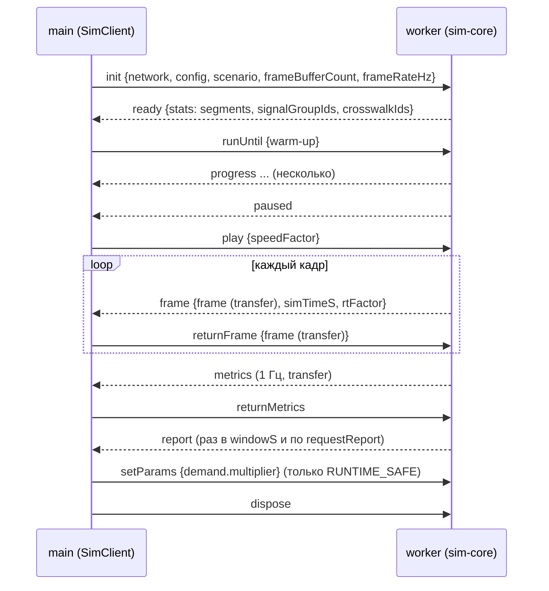

# Контракты

Источник истины: `packages/contracts/src/*.ts` (zod-схемы и типы). Этот документ объясняет смысл и инварианты.
Проверка сети: `parseNetwork(json)` (схема) + `checkNetworkIntegrity(net)` (ссылочная целостность). Оба обязаны
проходить у любого производителя сети: компилятора, синтетических билдеров, применения overrides.

## Изменение контрактов
Контракты заморожены на время волн 1–5. Агент, которому не хватает поля, завершает задачу без него и пишет
раздел «Требуется решение». Разрешено без согласования: добавить **опциональное** поле с default, если карточка
это явно допускает. Любое другое изменение: запись в `docs/DECISIONS.md`, bump `SCHEMA_VERSION` при несовместимости,
обновление всех потребителей в одной ветке.

## Координаты
- Локальные метры: x = восток, y = север; `meta.origin` — lon/lat точки (0, 0) = центр bbox.
- Проекция: равнопромежуточная с коэффициентом `cos(lat0)` (`map-data/src/projection.ts`).
- Three.js: `(x, y) → (x, 0, -y)`, ось Y вверх. Курс: радианы против часовой стрелки от +x.
- Геометрия линка идёт от `fromNode` к `toNode`; `s` — расстояние вдоль неё в метрах.

## Конвенция геометрии полос
`Link.geometry` — осевая линия проезжей части **этого направления** (компилятор смещает двусторонние улицы
на половину ширины направления). Центр полосы `i` = осевая, смещённая вправо по ходу движения на
`(i − (N − 1) / 2) · widthM`, где `N = link.laneIds.length`. Карман (`index 0`, `startS > 0`) занимает своё место
только на `[startS, endS]`: проезжая часть визуально расширяется перед перекрёстком, как в жизни. Полоса, которая
заканчивается раньше конца линка (`endS < lengthM`), например полоса разгона, аналогично.

## Идентификаторы
Строки, уникальные внутри коллекции. Рекомендуемые схемы для компилятора: узлы `n<osmNodeId>` или `n<seq>`;
линки `w<osmWayId>_<seq>_<f|b>` (forward/backward); полосы `<linkId>:<index>`; коннекторы
`<fromLaneId>>` + `<toLaneId>`; группы `<controllerId>.g<seq>`; фазы `<controllerId>.p<seq>`. Синтетические
сети используют короткие имена. Стабильность id между компиляциями одного снимка обязательна
(сценарии ссылаются на них).

## Network (network.ts)
| Сущность | Смысл | Ключевые инварианты |
|---|---|---|
| `Node` | Узел графа | `kind` определяет поведение: `signalized` требует контроллер, `gate` — запись в `gates`, `merge` — коннекторы `merge` |
| `Link` | Направленный участок | `laneIds` слева направо; `lengthM` = длина геометрии (допуск 1%) |
| `Lane` | Полоса | `index` = позиция в `link.laneIds`; `[startS, endS]` в пределах линка; `kind: bus` ⇒ есть `busLane`; `turn_pocket` ⇒ `startS > 0` |
| `Connector` | Движение через узел | `fromLane.link.toNode == viaNode == toLane.link.fromNode`; `turn ∈ fromLane.turns`; сигнализированный ⇒ `protection ∈ {protected, permissive}` и `signalGroupId` в контроллере узла |
| `ConflictPoint` | Пересечение двух коннекторов | симметричны (у обоих коннекторов есть запись), `priority` согласован (`this` у одного = `other` у другого или `signal` у обоих) |
| `Crosswalk` | Зебра | двусторонняя ссылка с `Connector.crosswalkIds`; `signalGroupId` ⇒ пешеходная группа контроллера |
| `SignalController` | Фиксированный план | группы уникальны, каждая зелёная хотя бы в одной фазе; `cycleLengthS()` = Σ фаз; `leftTurnModes` по входящим линкам |
| `BusStop`, `BusRoute` | ОТ | маршрут — связная цепочка линков от `entryNodeId` до `exitNodeId`; остановки на линках маршрута |
| `Gate`, `Attractor` | Спрос | ворота на узлах `kind: gate`; веса неотрицательны; сумма весов нормируется в рантайме |
| `Building`, `Area`, `Waterway` | Рендер | не участвуют в симуляции |

### Provenance
`provenance: { [attr]: "osm" | "default" | "manual" }` у сущностей. Компилятор обязан отмечать как минимум:
`Link.speedLimitKph`, `Link.laneIds` (число полос), `Lane.turns`, `Lane.busLane`, `Lane.startS` (карманы),
`SignalController.phases`, `SignalController.leftTurnModes`, `BusRoute.headwayPeakS`, `BusStop.kind`,
`Gate.weightIn/Out`, `Attractor.weightIn/Out`, `Building.heightM`. UI показывает легенду и долю допущений.

## SimConfig (sim-config.ts)
Полный конфиг с дефолтами: `defaultSimConfig(patch?)`; патчи — `DeepPartial`, применяются `applyConfigPatch`.
`RUNTIME_SAFE_PARAM_PATHS` — единственные пути, которые можно менять без перезапуска. Все распределения
водителей — усечённые нормальные (`Distribution`), сэмплируются один раз при рождении машины.

## Scenario и overrides (overrides.ts)
`Scenario = { id, name, networkId, overrides[], params }`. Overrides применяются компилятором детерминированно:
- `link.set.generalLanes / speedLimitKph / leftPocketLengthM / rightPocketLengthM / busLane` — перестраивает полосы
  линка и все коннекторы на его концах (генератор коннекторов запускается заново для затронутых узлов);
- `signal.set.cycleS / offsetS / greenS / leftTurnModes / pedestrianPhase` — генератор планов пересобирает фазы
  контроллера (включая добавление/удаление стрелок);
- `bus_stop.set.kind`, `bus_route.set.headway*/enabled`.
После применения: `checkNetworkIntegrity` обязателен; `meta.networkId` дополняется суффиксом сценария.

## Причины (causes.ts)
Коды стабильны, только добавление в конец. `DELAY_CAUSE_KEYS` — что считается «задержкой по вине
инфраструктуры/управления» при ранжировании. Семантика распространения корневой причины: `ARCHITECTURE.md`.

## Метрики (metrics.ts)
`SegmentDescriptor[]` отдаётся один раз в `ready`; `MetricsFrame` — typed arrays по индексу сегмента; `causeShare`
— матрица `segmentCount × CAUSE_COUNT` построчно. `BottleneckReport` — JSON: `totals` + `items` (Топ-N) с
`causes`, `recommendations` (готовые overrides) и `focus` для камеры. `RunSummary` — вывод CLI и эталон регрессии
(сравниваются `totals` и `top` с допусками, `trajectoryHash` — точно при одинаковой версии ядра).

## Буферы кадра (state.ts)
`FrameBuffers` — SoA на `capacity = demand.vehicleBudget`; валидны первые `count`. `id` стабилен на жизнь машины
(интерполяция в рендере по `id`). `flags` — биты `VehicleFlag`. `cause` — код немедленной причины.
`signalStates` — по глобальному порядку групп (контроллеры в порядке `network.signalControllers`, группы
в порядке `controller.groups`), `crosswalkPeds` — по порядку `network.crosswalks`. `frameTransferList` отдаёт
все буферы для transfer; после отправки массивы в отправителе пустые (detached), поэтому пинг-понг обязателен.

## Протокол воркера (protocol.ts)

Ошибки: `error {message, fatal}`; `fatal: true` означает, что воркер нужно пересоздать.
