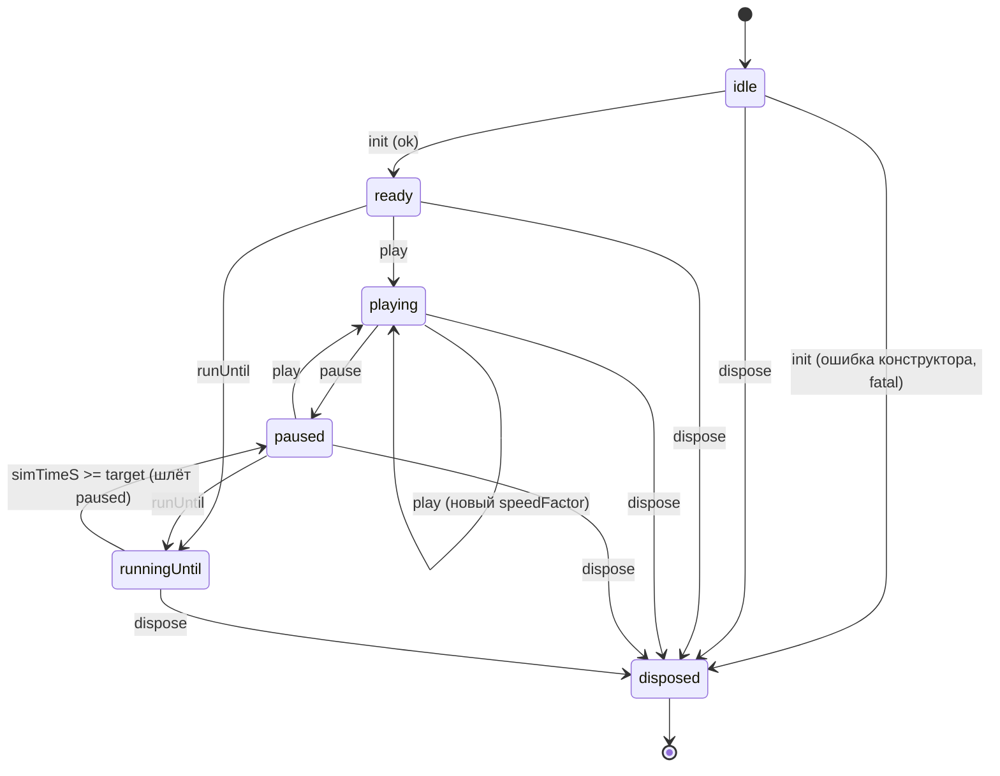

# @atl/sim-worker

Web Worker вокруг `@atl/sim-core`: протокол сообщений (`@atl/contracts/protocol`), пинг-понг
типизированных буферов кадра и метрик, клиент для главного потока. Сам ничего не считает и не
хранит логику симуляции — только цикл шагов, тайминг и передачу данных. Протокол и инварианты
буферов описаны в `docs/CONTRACTS.md` («Буферы кадра», «Протокол воркера»); поток данных — в
`docs/ARCHITECTURE.md` («Воркер и буферы»).

## Файлы

| Файл | Роль |
|---|---|
| `src/worker-main.ts` | Чистая функция `createWorkerMain({ post, createSimulation? })`: состояние, цикл шагов, ping-pong буферов. Без `self` — тестируется в node. |
| `src/worker.ts` | Тонкая обёртка `worker-main` над `self` для браузера. `?sim=stub` в URL воркера включает `StubSimulation` вместо `@atl/sim-core`. |
| `src/client.ts` | `createSimClient({ createWorker, ... })`: промисы `init`/`runUntil`, подписки, автоматический `returnFrame`/`returnMetrics`. |
| `src/stub-simulation.ts` | `createStubSimulation`: 500 точек по кругу, детерминированная функция от `simTimeS`. Подменяет `@atl/sim-core` до T-04. |
| `src/index.ts` | Публичный экспорт пакета. |

## Состояния воркера

`worker-main` — конечный автомат. `init` создаёт симуляцию и переводит в `ready`; `play`/`pause`
переключают `playing` ⇄ `paused`; `runUntil` — отдельный режим перемотки без пауз, который сам
возвращается в `paused` по достижении цели. Любое сообщение не по протоколу (например `play` до
`init`) отвечает `error {fatal: false}` и не меняет состояние. `dispose` — терминальное состояние:
дальнейшие сообщения игнорируются.

Сообщение, не подходящее текущему состоянию (например `pause` вне `playing`), не меняет состояние
диаграммы — воркер остаётся там же и отвечает `error {fatal: false}`.

## Цикл `play`

Каждая итерация планируется через `setTimeout(fn, 0)` (в воркере нет `requestAnimationFrame`), и
именно поэтому это не блокирующий `while`-цикл: воркер обязан отдавать управление между итерациями,
иначе `pause`/`returnFrame`/`dispose` не будут обработаны. Шаги накапливаются через аккумулятор
(`accumulatorS += elapsedWallS * speedFactor`, конвертация в шаги по `dtS`), а не пересчётом
`floor(speedFactor * elapsedWall / dtS)` с нуля на каждый тик — так остаток времени, отрезанный
`maxStepsPerIteration` (по умолчанию 50), не теряется, а переносится на следующую итерацию.
При возобновлении после `pause` время простоя не накапливается (не даёт "рывка" вперёд).

`rtFactor` — EMA отношения фактически пройденного sim-времени к запрошенному (`speedFactor`) за
итерацию; 1 = воркер успевает. Кадр пишется в `writeFrame` и уходит `postMessage` с transfer только
если прошло `1000 / frameRateHz` мс с прошлой отправки **и** есть свободный буфер (иначе воркер
молча пропускает кадр и повторяет попытку на следующей итерации). Буфер отправителя после transfer
detached; переиспользовать его можно только после `returnFrame` тем же путём назад. Метрики и отчёт
не завязаны на `playing`/`runningUntil` — сэмплируются по `simTimeS`, поэтому продолжают идти и во
время перемотки `runUntil`.

## `RUNTIME_SAFE_PARAM_PATHS`

`setParams` разбирает патч на пути вида `"demand.multiplier"` и сравнивает с
`RUNTIME_SAFE_PARAM_PATHS` из `@atl/contracts`. Если хоть один задетый путь не входит в список —
патч целиком отклоняется, `sim.setParams` не вызывается, в ответ уходит `error {fatal: false}`.

## StubSimulation

`createStubSimulation` реализует интерфейс `Simulation`, но не читает `network`: 500 машин движутся
по окружности, позиция — чистая функция `simTimeS` (без интегрирования, без дрейфа). Нужна, чтобы
протокол воркера и будущий рендер (T-13) можно было тестировать/показывать до готовности реального
ядра (T-04). `worker.ts` выбирает её вместо `@atl/sim-core` по `?sim=stub` в URL воркера —
`apps/web/src/DebugWorkerView.tsx` (страница `/?debug=worker`) использует это, чтобы показать
движение точек живьём; страница временная и уйдёт вместе с T-13.

## Тесты

`test/fake-worker.ts` — `Worker`-совместимая обвязка над `createWorkerMain`, соединённая с клиентом
настоящим `MessageChannel` (а не прямыми вызовами), чтобы протокол-тесты проверяли реальный
structured-clone/transfer (detach буферов), а не только логику стейт-машины. `test/protocol.test.ts`
гоняет сценарии протокола (init → ready, кадры за реальное время, буфер не шлётся без свободного,
`returnFrame` реально восстанавливает буфер, `setParams` отклоняет небезопасный путь, `runUntil` →
`progress` + `paused`, `dispose` после fatal-ошибки). `test/stub-simulation.test.ts` и
`test/param-guard.test.ts` — точечные unit-тесты соответствующих модулей.
